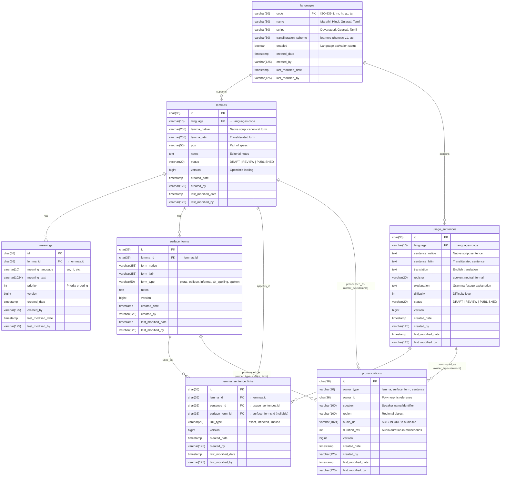
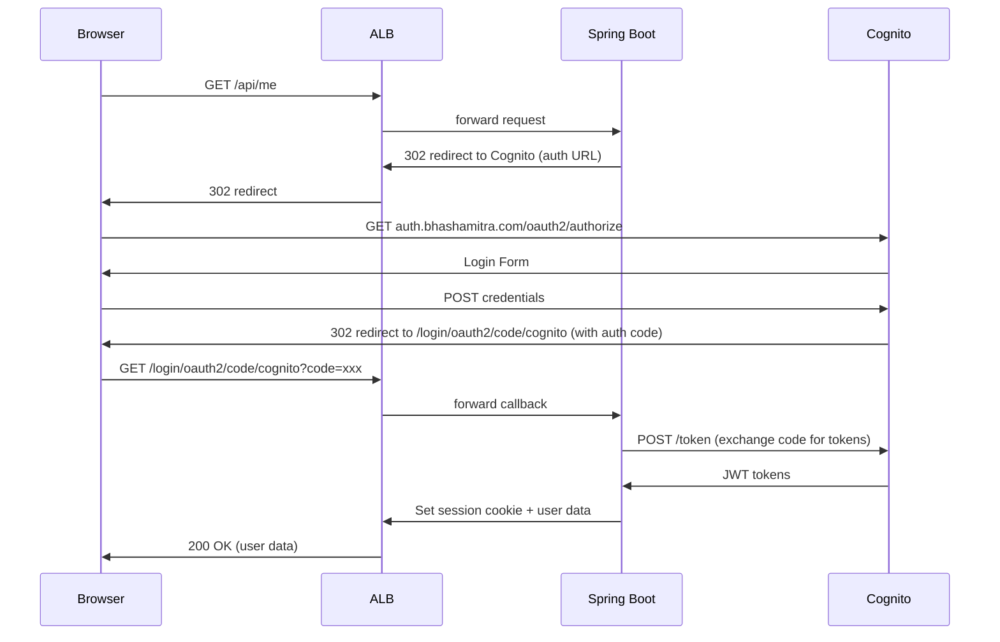

# BhashaMitra Platform - High-Level Design Document

## Overview

BhashaMitra is a cloud-native Indian language learning platform built on AWS using modern microservices architecture. The platform provides a scalable, secure, and cost-effective solution for language learning with support for multiple Indian languages including Marathi, Hindi, Gujarati, and Tamil.

### Philosophy and Approach

BhashaMitra follows a **usage-first** approach to language learning, emphasizing:
- Real-world usage over abstract definitions
- Spoken and written language distinctions  
- High-frequency vocabulary with contextual learning
- Living language representation through sentences and audio
- Quality over quantity in content curation

The platform is built around a stable **Language Core** that defines language-agnostic primitives applicable across all Indian languages, ensuring consistent modeling and representation.

## Application Architecture

### Spring Boot Application Structure

```
com.bhashamitra.platform/
├── BhashaMitraApplication.java          # Main application class
├── config/
│   └── SecurityConfig.java             # OAuth2 and security configuration
└── controllers/
    ├── MeController.java                # User profile API (/api/me)
    └── VersionController.java           # Application info API (/api/version)

Configuration Profiles:
├── application.properties               # Base configuration with Cognito setup
├── application-local.yml               # Local development with MySQL
└── application-production.yml          # Production with Aurora via Secrets Manager
```

### Frontend Application Structure

```
frontend/
├── src/
│   ├── main.tsx                        # React application entry point
│   ├── App.tsx                         # Main application component
│   ├── index.css                       # Global styles with Warriors theme
│   └── assets/                         # Static assets
├── public/                             # Public assets
├── dist/                               # Vite build output (copied to Spring Boot)
├── vite.config.ts                      # Vite configuration with React + Tailwind
├── tsconfig.json                       # TypeScript configuration
└── package.json                        # Dependencies and build scripts
```

### Integration Architecture

The application uses a **monolithic deployment** with **embedded frontend** approach:

1. **Build Process**: Maven frontend plugin installs Node.js and builds React app
2. **Resource Integration**: Vite output copied to `backend/src/main/resources/static/`
3. **Serving Strategy**: Spring Boot serves React SPA and provides REST APIs
4. **Development**: Separate dev servers (Spring Boot :8080, Vite :5173) with proxy
5. **Production**: Single JAR contains both frontend and backend

## System Architecture

### Complete System Diagram

```
┌─────────────────────────────────────────────────────────────────────────────────┐
│                                 Internet                                        │
└─────────────────────────────────┬───────────────────────────────────────────────┘
                                  │
┌─────────────────────────────────┴───────────────────────────────────────────────┐
│                            Route 53 DNS                                        │
│  ┌─────────────────────┐    ┌─────────────────────┐                           │
│  │ bhashamitra.com     │    │ auth.bhashamitra.com│                           │
│  │ www.bhashamitra.com │    │                     │                           │
│  └─────────────────────┘    └─────────────────────┘                           │
└─────────────┬───────────────────────┬───────────────────────────────────────────┘
              │                       │
              │                       │
┌─────────────▼───────────────────────┐ ┌─────────▼─────────────────────────────────┐
│        Application Load             │ │         AWS Cognito                       │
│         Balancer (ALB)              │ │      User Pool + Hosted UI               │
│                                     │ │                                           │
│  • SSL Termination                  │ │  • Email-based Authentication             │
│  • HTTPS-only (443)                 │ │  • Custom Domain (auth.bhashamitra.com)  │
│  • HTTP→HTTPS Redirect              │ │  • User Groups: learner, editor, admin   │
│  • www→non-www Redirect             │ │  • OAuth2 Integration                    │
└─────────────┬───────────────────────┘ └───────────────────────────────────────────┘
              │
              │
┌─────────────▼───────────────────────────────────────────────────────────────────┐
│                              ECS Fargate Cluster                               │
│                                                                                 │
│  ┌─────────────────────────────────────────────────────────────────────────┐   │
│  │                    Spring Boot Application                              │   │
│  │                                                                         │   │
│  │  ┌─────────────────┐  ┌─────────────────┐  ┌─────────────────────────┐ │   │
│  │  │   Controllers   │  │   Security      │  │    Static Resources     │ │   │
│  │  │                 │  │   Config        │  │                         │ │   │
│  │  │ • /api/me       │  │                 │  │ • React SPA             │ │   │
│  │  │ • /api/version  │  │ • OAuth2 Login  │  │ • Vite + TypeScript     │ │   │
│  │  │                 │  │ • CSRF Config   │  │ • Tailwind CSS          │ │   │
│  │  └─────────────────┘  └─────────────────┘  └─────────────────────────┘ │   │
│  │                                                                         │   │
│  │  ┌─────────────────┐  ┌─────────────────┐  ┌─────────────────────────┐ │   │
│  │  │   Data Layer    │  │   Liquibase     │  │    Health Checks        │ │   │
│  │  │                 │  │   Migrations    │  │                         │ │   │
│  │  │ • Spring Data   │  │                 │  │ • /actuator/health/     │ │   │
│  │  │   JPA           │  │ • Schema Mgmt   │  │   liveness              │ │   │
│  │  │ • MySQL Driver  │  │ • Version Ctrl  │  │ • Container Health      │ │   │
│  │  └─────────────────┘  └─────────────────┘  └─────────────────────────┘ │   │
│  └─────────────────────────────────────────────────────────────────────────┘   │
│                                                                                 │
│  • CPU: 0.25 vCPU                                                              │
│  • Memory: 512 MB                                                              │
│  • Auto-scaling capable                                                        │
│  • Container Insights enabled                                                  │
└─────────────────────────┬───────────────────────────────────────────────────────┘
                          │
                          │
┌─────────────────────────▼───────────────────────────────────────────────────────┐
│                        Aurora Serverless v2 MySQL                             │
│                                                                                 │
│  ┌─────────────────────────────────────────────────────────────────────────┐   │
│  │                     Linguistic Database Schema                          │   │
│  │                                                                         │   │
│  │  ┌─────────────────┐  ┌─────────────────┐  ┌─────────────────────────┐ │   │
│  │  │   languages     │  │     lemmas      │  │      meanings           │ │   │
│  │  │                 │  │                 │  │                         │ │   │
│  │  │ • code (PK)     │  │ • id (PK)       │  │ • id (PK)               │ │   │
│  │  │ • name          │  │ • language (FK) │  │ • lemma_id (FK)         │ │   │
│  │  │ • script        │  │ • lemma_native  │  │ • meaning_language      │ │   │
│  │  │ • enabled       │  │ • lemma_latin   │  │ • meaning_text          │ │   │
│  │  │                 │  │ • pos, status   │  │ • priority              │ │   │
│  │  └─────────────────┘  └─────────────────┘  └─────────────────────────┘ │   │
│  │                                                                         │   │
│  │  ┌─────────────────┐  ┌─────────────────┐  ┌─────────────────────────┐ │   │
│  │  │ surface_forms   │  │ usage_sentences │  │ lemma_sentence_links    │ │   │
│  │  │                 │  │                 │  │                         │ │   │
│  │  │ • id (PK)       │  │ • id (PK)       │  │ • id (PK)               │ │   │
│  │  │ • lemma_id (FK) │  │ • language (FK) │  │ • lemma_id (FK)         │ │   │
│  │  │ • form_native   │  │ • sentence_native│ │ • sentence_id (FK)      │ │   │
│  │  │ • form_latin    │  │ • sentence_latin│  │ • surface_form_id (FK)  │ │   │
│  │  │ • form_type     │  │ • translation   │  │ • link_type             │ │   │
│  │  └─────────────────┘  └─────────────────┘  └─────────────────────────┘ │   │
│  │                                                                         │   │
│  │  ┌─────────────────────────────────────────────────────────────────┐   │   │
│  │  │                    pronunciations                               │   │   │
│  │  │                                                                 │   │   │
│  │  │ • id (PK)                                                       │   │   │
│  │  │ • owner_type (lemma/surface_form/sentence)                      │   │   │
│  │  │ • owner_id (polymorphic FK)                                     │   │   │
│  │  │ • speaker, region, audio_uri, duration_ms                      │   │   │
│  │  └─────────────────────────────────────────────────────────────────┘   │   │
│  └─────────────────────────────────────────────────────────────────────────┘   │
│                                                                                 │
│  • Engine: Aurora MySQL 8.0                                                    │
│  • Scaling: 0.5-2.0 ACUs (Auto-scaling)                                       │
│  • Character Set: utf8mb4 (Indian language support)                           │
│  • Multi-AZ deployment with 7 interconnected tables                           │
│  • Comprehensive indexing for linguistic queries                              │
│  • Status-based content workflow (DRAFT → REVIEW → PUBLISHED)                 │
└─────────────────────────────────────────────────────────────────────────────────┘

┌─────────────────────────────────────────────────────────────────────────────────┐
│                            Supporting Services                                  │
│                                                                                 │
│  ┌─────────────────┐  ┌─────────────────┐  ┌─────────────────────────────────┐ │
│  │ AWS Secrets     │  │ CloudWatch      │  │ GitHub Actions CI/CD           │ │
│  │ Manager         │  │ Logs            │  │                                 │ │
│  │                 │  │                 │  │ • OIDC Authentication           │ │
│  │ • DB Credentials│  │ • Application   │  │ • ECR Image Push                │ │
│  │ • Auto-rotation │  │   Logs          │  │ • ECS Deployment                │ │
│  │ • Encryption    │  │ • 7-day         │  │ • Zero-downtime Updates         │ │
│  │                 │  │   Retention     │  │                                 │ │
│  └─────────────────┘  └─────────────────┘  └─────────────────────────────────┘ │
└─────────────────────────────────────────────────────────────────────────────────┘
```

## Technology Stack

### Frontend
- **Framework**: React 19.2.0 with TypeScript
- **Build Tool**: Vite 7.2.4 with SWC plugin for fast compilation
- **Styling**: Tailwind CSS 4.1.18 with custom Warriors color palette
- **Development**: ESLint with TypeScript support, hot module replacement
- **Deployment**: Built and served as static resources from Spring Boot
- **Integration**: Embedded in Spring Boot JAR via Maven frontend plugin

### Backend  
- **Framework**: Spring Boot 4.0.1 (Java 21)
- **Security**: Spring Security with OAuth2 Client for Cognito integration
- **Database**: Spring Data JPA with MySQL Connector 9.5.0
- **Migration**: Liquibase 5.0.1 for version-controlled schema management
- **Monitoring**: Spring Boot Actuator with health endpoints
- **Build**: Maven multi-module project with frontend integration
- **Architecture**: RESTful APIs with clear separation of concerns

### Infrastructure
- **Cloud Provider**: AWS (us-west-1 region)
- **Compute**: ECS Fargate with auto-scaling capabilities
- **Database**: Aurora Serverless v2 MySQL with multi-AZ deployment
- **Authentication**: AWS Cognito User Pool with custom domain
- **Load Balancer**: Application Load Balancer with SSL termination
- **DNS**: Route 53 with automatic SSL certificate management
- **SSL**: AWS Certificate Manager with auto-renewal
- **Secrets**: AWS Secrets Manager for secure credential storage
- **Monitoring**: CloudWatch Logs and Container Insights
- **CI/CD**: GitHub Actions with OIDC authentication (no access keys)

## Data Model

### Entity Relationship Diagram



### Database Design Principles

1. **Multi-Language Support**: 
   - Centralized language configuration with ISO 639-1 codes
   - Native script storage with optional transliteration
   - UTF-8 (utf8mb4) character set for all Indian languages

2. **Linguistic Data Model**:
   - **Lemmas**: Canonical word forms with part-of-speech tagging
   - **Surface Forms**: Inflected forms, plurals, alternate spellings
   - **Meanings**: Multi-language definitions with priority ordering
   - **Usage Sentences**: Contextual examples with difficulty levels
   - **Pronunciations**: Audio recordings with speaker/region metadata

3. **Content Management**:
   - Status workflow: DRAFT → REVIEW → PUBLISHED
   - Version control with optimistic locking
   - Comprehensive audit trails (created/modified by/date)

4. **Flexible Relationships**:
   - Many-to-many lemma-sentence relationships via link table
   - Polymorphic pronunciations (can attach to lemmas, forms, or sentences)
   - Hierarchical surface forms linked to base lemmas

5. **Performance Optimization**:
   - Strategic indexing for language-based queries
   - Unique constraints to prevent data duplication
   - Foreign key constraints for referential integrity

6. **Scalability Features**:
   - UUID primary keys for distributed systems
   - Nullable transliteration for gradual content building
   - Extensible form types and link types for future needs

## Security Architecture

### Authentication Flow with Cognito



**Configuration Details:**
- Client ID: `7cdbeojvue3dmmlks8qf3hf3gj`
- User Pool ID: `us-west-1_EAIAbURr1`  
- Custom Domain: `auth.bhashamitra.com`
- Callback URLs: `/login/oauth2/code/cognito`
- Scopes: `openid`, `email`, `profile`
- User Groups: `learner` (default), `editor`, `admin`

### Security Features

1. **OAuth2 Integration**: Cognito User Pool with custom domain
2. **JWT Tokens**: Secure token-based authentication
3. **Role-Based Access**: User groups (learner, editor, admin)
4. **HTTPS Enforcement**: SSL termination at ALB level
5. **Secrets Management**: Database credentials in AWS Secrets Manager
6. **Network Security**: VPC with security groups
7. **Token Revocation**: Enabled for secure logout

## Deployment Architecture

### CI/CD Pipeline with GitHub Actions

```
┌─────────────────────────────────────────────────────────────────────────────────┐
│                           GitHub Repository                                     │
│                     bhashamitra/bhashamitra-platform                           │
└─────────────────────────────┬───────────────────────────────────────────────────┘
                              │ Push to main / Manual trigger
                              ▼
┌─────────────────────────────────────────────────────────────────────────────────┐
│                         GitHub Actions Workflow                                │
│                                                                                 │
│  ┌─────────────────────┐  ┌─────────────────────┐  ┌─────────────────────────┐  │
│  │   Build Stage       │  │   Docker Stage      │  │   Deploy Stage          │  │
│  │                     │  │                     │  │                         │  │
│  │ 1. Checkout code    │  │ 4. Set up Buildx    │  │ 7. Update task def      │  │
│  │ 2. Configure AWS    │  │ 5. Build multi-arch │  │ 8. Deploy to ECS        │  │
│  │    (OIDC)           │  │    Docker image     │  │ 9. Wait for stability   │  │
│  │ 3. Login to ECR     │  │ 6. Push to ECR      │  │ 10. Verify deployment   │  │
│  └─────────────────────┘  └─────────────────────┘  └─────────────────────────┘  │
│                                                                                 │
│  Security Features:                                                             │
│  • OIDC authentication (no access keys)                                        │
│  • Least privilege IAM roles                                                   │
│  • Multi-architecture builds (linux/amd64)                                     │
│  • Immutable ECR tags                                                          │
└─────────────────────────────────────────────────────────────────────────────────┘
                              │
                              ▼
┌─────────────────────────────────────────────────────────────────────────────────┐
│                              AWS ECS                                           │
│                                                                                 │
│  ┌─────────────────────────────────────────────────────────────────────────┐   │
│  │                    Deployment Process                                   │   │
│  │                                                                         │   │
│  │  1. ECS receives new task definition                                    │   │
│  │  2. Rolling deployment starts (50% min, 200% max)                      │   │
│  │  3. New tasks start with health checks                                 │   │
│  │  4. ALB health checks validate endpoints                               │   │
│  │  5. Old tasks gracefully terminated                                    │   │
│  │  6. Service reaches desired state                                      │   │
│  └─────────────────────────────────────────────────────────────────────────┘   │
└─────────────────────────────────────────────────────────────────────────────────┘

Build Process Details:
┌─────────────────────────────────────────────────────────────────────────────────┐
│                            Docker Multi-Stage Build                            │
│                                                                                 │
│  ┌─────────────────────────────────────────────────────────────────────────┐   │
│  │                        Build Stage                                      │   │
│  │                                                                         │   │
│  │  FROM maven:3.9.9-eclipse-temurin-21                                   │   │
│  │                                                                         │   │
│  │  1. Copy source code                                                    │   │
│  │  2. Maven build (includes frontend via plugin):                        │   │
│  │     • Install Node.js 20.19.6 + npm 10.8.2                            │   │
│  │     • npm ci (install dependencies)                                     │   │
│  │     • npm run build (Vite build)                                        │   │
│  │     • Copy frontend dist/ to backend/resources/static/                 │   │
│  │     • Maven compile and package Spring Boot JAR                        │   │
│  └─────────────────────────────────────────────────────────────────────────┘   │
│                                    │                                           │
│                                    ▼                                           │
│  ┌─────────────────────────────────────────────────────────────────────────┐   │
│  │                       Runtime Stage                                     │   │
│  │                                                                         │   │
│  │  FROM eclipse-temurin:21-jre                                            │   │
│  │                                                                         │   │
│  │  1. Copy JAR from build stage                                           │   │
│  │  2. Set JVM options for containers                                      │   │
│  │  3. Expose port 8080                                                    │   │
│  │  4. Configure health checks                                             │   │
│  └─────────────────────────────────────────────────────────────────────────┘   │
└─────────────────────────────────────────────────────────────────────────────────┘
```

### Infrastructure as Code

- **Terraform**: Complete infrastructure definition
- **State Management**: Remote state in S3 (MVL infrastructure)
- **Resource Reuse**: Leverages existing VPC and networking
- **Cost Optimization**: Serverless and auto-scaling components

## Development Workflow

### Local Development Setup

```
Prerequisites:
├── Java 21 (OpenJDK or Oracle JDK)
├── Maven 3.9+
├── Node.js 20+ and npm (for frontend development)
└── MySQL 8.0+ (local database)

Database Setup:
├── CREATE DATABASE bhashamitra CHARACTER SET utf8mb4 COLLATE utf8mb4_0900_ai_ci;
├── CREATE USER 'bhashamitra'@'localhost' IDENTIFIED BY 'bhashamitra';
├── GRANT ALL PRIVILEGES ON bhashamitra.* TO 'bhashamitra'@'localhost';
└── FLUSH PRIVILEGES;

Development Commands:
├── Backend: mvn spring-boot:run -Dspring-boot.run.profiles=local
├── Frontend (optional): cd frontend && npm run dev
├── Full Build: mvn clean package (includes frontend build)
└── Docker Build: docker build -t bhashamitra-platform .

Access Points:
├── Full Application: http://localhost:8080/
├── Health Check: http://localhost:8080/actuator/health
├── API Endpoints: http://localhost:8080/api/
└── Frontend Dev Server: http://localhost:5173/ (if running separately)
```

### Configuration Management

```
Environment Configurations:
├── application.properties          # Base config with Cognito setup
├── application-local.yml           # Local development
│   ├── MySQL connection: localhost:3306/bhashamitra
│   ├── Show SQL: true
│   └── Health details: always
└── application-production.yml      # Production
    ├── Aurora connection via Secrets Manager
    ├── Show SQL: false
    └── Health details: never

Secrets Management:
├── Local: Plain text credentials in YAML
├── Production: AWS Secrets Manager
│   ├── DB_HOST, DB_PORT, DB_NAME
│   ├── DB_USERNAME, DB_PASSWORD
│   ├── COGNITO_CLIENT_ID
│   └── COGNITO_USER_POOL_ID
```

## Scalability & Performance

### Auto-Scaling Strategy
1. **ECS Service**: Horizontal scaling based on CPU/memory metrics
3. **ALB**: Built-in high availability and load distribution
4. **CloudFront**: Future CDN integration for static assets

### Performance Optimizations

1. **Database Indexing**: Optimized for language-based queries
2. **Connection Pooling**: Spring Boot HikariCP
3. **Caching Strategy**: Future Redis integration planned
4. **Static Asset Optimization**: Vite build optimization

## Monitoring & Observability

### Logging Strategy

```
Application Logs → CloudWatch Logs → (Future: ELK Stack)
     ↓
Health Checks → ALB Target Health → CloudWatch Metrics
     ↓
Database Metrics → Aurora Insights → CloudWatch Dashboards
```

### Health Checks

1. **Container Health**: Spring Boot Actuator liveness probe
2. **ALB Health**: Target group health checks
3. **Database Health**: Aurora cluster monitoring
4. **Application Metrics**: Spring Boot metrics endpoints

## Cost Optimization

### Resource Sizing

- **ECS Fargate**: 0.25 vCPU, 512 MB (minimal for development)
- **Aurora Serverless**: 0.5-2.0 ACUs (scales to zero when idle)
- **ALB**: Pay-per-use model
- **Route 53**: Minimal DNS query costs

### Cost Controls

1. **Serverless Architecture**: Pay only for actual usage
2. **Resource Sharing**: Reuse existing VPC infrastructure
3. **Log Retention**: 7-day retention to minimize storage costs
4. **Auto-scaling**: Prevent over-provisioning

## Future Enhancements

### Phase 2 Features

1. **Enhanced Content Management**:
   - User-generated content and community contributions
   - Advanced search across all linguistic data
   - Content curation workflows and editorial tools
   - Bulk import/export capabilities

2. **Learning Features**:
   - Adaptive learning algorithms based on user progress
   - Spaced repetition system for vocabulary retention
   - Interactive exercises using surface forms and sentences
   - Progress tracking and achievement systems

3. **Audio Integration**:
   - Text-to-speech integration for missing pronunciations
   - Voice recognition for pronunciation practice
   - Regional dialect support and comparison
   - Audio quality assessment and moderation

4. **Advanced Linguistics**:
   - Morphological analysis and generation
   - Semantic relationships between lemmas
   - Etymology and word origin tracking
   - Cross-language cognate identification

### Technical Improvements

1. **Caching Layer**: Redis for session and data caching
2. **CDN Integration**: CloudFront for global content delivery
3. **Monitoring Enhancement**: Detailed application metrics
4. **Testing Strategy**: Comprehensive test automation
5. **Mobile Support**: React Native or PWA implementation

## Conclusion

The BhashaMitra platform is designed as a modern, cloud-native application that leverages AWS managed services for scalability, security, and cost-effectiveness. The architecture supports the current MVP requirements while providing a solid foundation for future enhancements and growth.

The system successfully demonstrates:
- **Secure Authentication**: Cognito integration with custom domain
- **Scalable Infrastructure**: ECS Fargate with Aurora Serverless
- **Modern Development**: React + Spring Boot with CI/CD
- **Cost Efficiency**: Serverless and auto-scaling components
- **Production Ready**: SSL, monitoring, and backup strategies

This design provides a robust foundation for building a comprehensive Indian language learning platform.